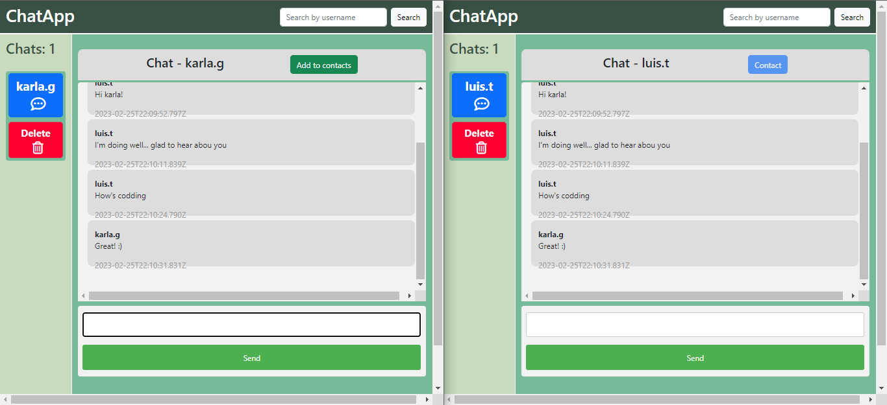

## CHAT APP WITH DJANGO AND JAVASCRIPT

This project is a real-time chat application that allows users to register and connect with other users of the application. It uses Python, Django, JavaScript, AJAX technologies and is connected to a PostgreSQL database.

### Features

- Registration and login as a user of the application
- View contacts
- Add new contacts
- Search contacts by filter
- View all app users
- Delete contacts
- Delete own account
- Access/create new conversation
- Add contact to conversation if not already a contact
- Delete conversation (this will automatically delete all messages in the database)

**Used technologies**

- Python
- django
- JavaScript
- AJAX
- PostgreSQL

**Installation and configuration**

- Install Python and Django on your computer by following the steps in the official documentation.
- Install PostgreSQL (or the management system you want to use) and create a database for the application.
- Clone this repository on your computer and access the application directory.
- Configure the connection to the database in Django's settings.py file.
- Run python manage.py makemigrations and python manage.py migrate to apply the migrations to the database.
- Run python manage.py runserver to start the development server.

**Use**

- Access http://127.0.0.1:8000/ in your browser to log in or register as a user of the application.
- Once registered, you can view your contacts, add new contacts, start conversations and more.
- Open an incognito window of the browser accessing the same local server, create a user, log in, add the contact with whom you have previously logged in and start a conversation in real time.

**Considerations**

- This project is just a base for a chat application and can be modified and improved according to the user's needs.
- The real-time messaging functionality is implemented with JavaScript and AJAX.
- It is recommended to have a basic knowledge of Python, Django, JavaScript and AJAX before modifying this project.
- The design is not responsive

Super user:
username: admin.chat
password: adminchat
